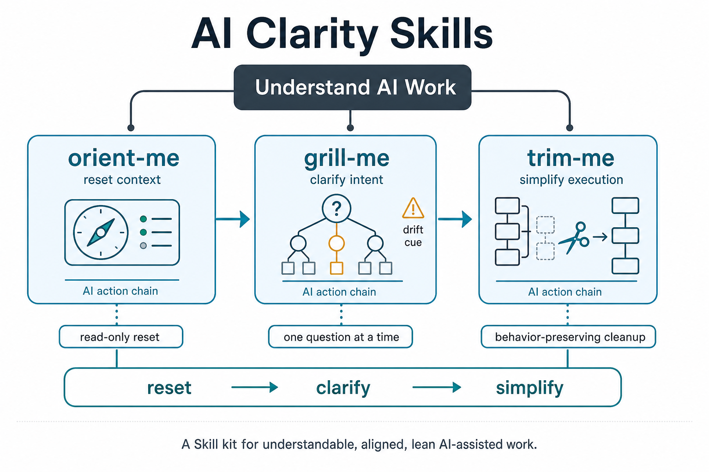

# ai-clarity-skills



A small collection of Skills for keeping AI-assisted work understandable, aligned, and lean.

## Skills

- `orient-me`: reset context when the user cannot tell what the AI is doing.
- `plain-me`: make confusing AI output, code, data, documents, or technical text easier to understand.
- `grill-me`: question a plan one decision at a time until the goal is clear.
- `untangle-me`: map the project spine, reading order, and complexity hotspots before safe simplification.
- `trim-me`: inspect a project and simplify it while preserving behavior.

## Install

Clone the repo, then symlink the Skill folders into your local Skills directory:

```sh
git clone https://github.com/Jianxinnn/ai-clarity-skills.git
cd ai-clarity-skills

mkdir -p ~/.codex/skills
for skill in orient-me plain-me grill-me untangle-me trim-me; do ln -s "$PWD/skills/$skill" ~/.codex/skills/$skill; done
```

For Claude / Claude Code, use `~/.claude/skills/` or a project-local `.claude/skills/` instead, then restart the client.

## Suggested Flow

```text
orient-me -> plain-me -> grill-me -> untangle-me -> trim-me
reset context -> lower comprehension load -> clarify intent -> map the codebase -> simplify execution
```

Use these when a long AI-assisted project starts to feel confusing, overgrown, or misaligned.
